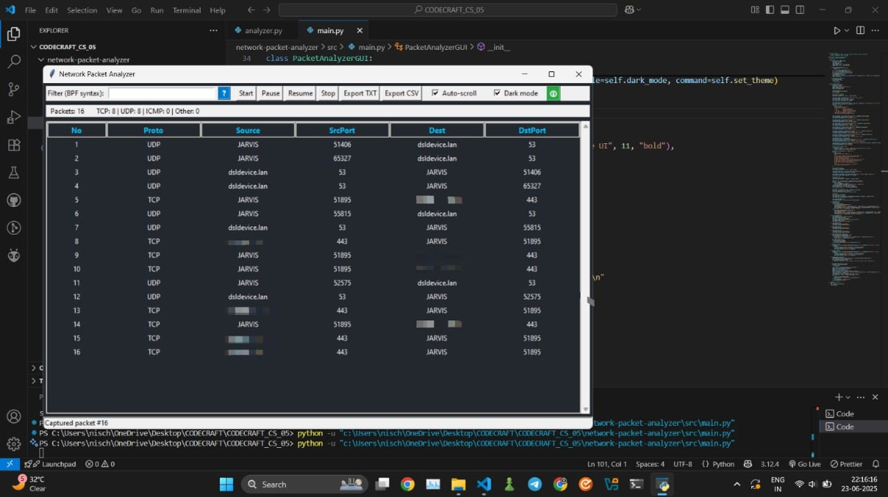

# Network Packet Analyzer

## Overview

**Network Packet Analyzer** is a user-friendly, GUI-based tool for capturing and analyzing network packets in real time. Built with Python, Tkinter, and Scapy, it provides powerful features for both beginners and advanced users to inspect, filter, and export network traffic.

---

## Features

- **Live Packet Capture:** Start, pause, resume, and stop packet capturing with a single click.
- **Protocol & Port Display:** View protocol names (TCP, UDP, ICMP), source/destination IPs (with hostname resolution), and ports.
- **BPF Filtering:** Filter packets using Wireshark/tcpdump-style expressions (e.g., `tcp`, `port 80`, `host 8.8.8.8`).
- **Auto-Scroll:** Optionally auto-scroll to the latest packet.
- **Dark Mode:** Toggle between light and dark themes for comfortable viewing.
- **Export:** Save captured packets to TXT or CSV files.
- **Detailed View:** Double-click any packet for a detailed breakdown of headers and payload.
- **Live Statistics:** See total packet count and per-protocol counts.
- **Manual & Tooltips:** Hover over the help icons for quick usage instructions and filter syntax help.

---

## How to Use

1. **Run as Administrator:**  
   For packet capture, run the tool with administrator privileges.

2. **Start Capturing:**  
   - Click **Start** to begin capturing packets.
   - Use the **Pause** and **Resume** buttons to temporarily halt or continue capturing.
   - Click **Stop** to end the capture session.

3. **Apply Filters (Optional):**  
   - Enter a filter in the "Filter (BPF syntax)" box (e.g., `tcp`, `port 80`, `host 8.8.8.8`).
   - Leave blank to capture all packets.
   - Hover over the `?` icon for filter syntax help.

4. **View Packets:**  
   - Captured packets appear in a sortable table.
   - Double-click any row for detailed packet information.

5. **Export Data:**  
   - Use **Export TXT** or **Export CSV** to save your captured data.

6. **Dark Mode & Help:**  
   - Toggle **Dark mode** for a comfortable viewing experience.
   - Hover over the green `🛈` icon for a quick manual.

---

## Example Filters

- `tcp` — Only TCP packets  
- `udp` — Only UDP packets  
- `port 53` — Packets to/from port 53  
- `host 8.8.8.8` — Packets to/from 8.8.8.8  
- `tcp and port 80` — Only HTTP traffic

---

## Requirements

- Python 3.x
- [Scapy](https://scapy.net/) (`pip install scapy`)

---

## Ethical Use

> **This tool is for educational and authorized network analysis only. Do not use it on networks without permission.**

---

## Screenshot

---

## Future Scope
- Add support for saving and loading PCAP files for offline packet analysis.
- Improve protocol decoding to extract higher-level information (DNS, HTTP headers, TLS metadata).
- Introduce basic traffic statistics such as packet rate, protocol distribution, and top source/destination IPs.
- Implement simple security detections like port scanning or abnormal traffic patterns.
- Enhance the GUI with search, filtering, and packet highlighting for easier inspection.

---

## License

MIT License
